# ResQLink Frontend - Detailed Flow Chart

## Project Overview
**Application Name:** ResQLink Emergency Reporting Mobile Application  
**Technology:** React Native + Expo + TypeScript  
**Purpose:** Emergency reporting with location tracking, hotline access, and report management  

---

## Table of Contents
1. [Application Launch Flow](#1-application-launch-flow)
2. [Authentication Flow](#2-authentication-flow)
3. [Main Application Flow](#3-main-application-flow)
4. [Emergency Reporting Flow](#4-emergency-reporting-flow)
5. [SOS Emergency Flow](#5-sos-emergency-flow)
6. [Hotline Access Flow](#6-hotline-access-flow)
7. [Profile Management Flow](#7-profile-management-flow)
8. [Report Tracking Flow](#8-report-tracking-flow)
9. [Data Flow Architecture](#9-data-flow-architecture)
10. [Error Handling Flow](#10-error-handling-flow)

---

## 1. Application Launch Flow

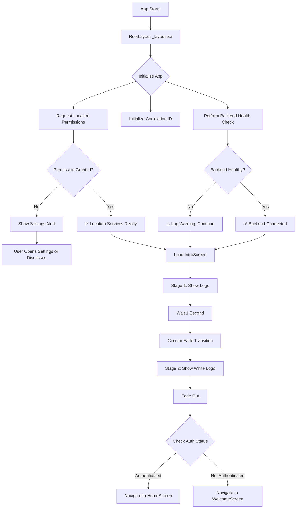
```mermaid
flowchart TD
    A[App Starts] --> B[RootLayout _layout.tsx]
    B --> C{Initialize App}
    C --> D[Request Location Permissions]
    C --> E[Initialize Correlation ID]
    C --> F[Perform Backend Health Check]
    
    D --> G{Permission Granted?}
    G -->|Yes| H[✅ Location Services Ready]
    G -->|No| I[Show Settings Alert]
    I --> J[User Opens Settings or Dismisses]
    
    F --> K{Backend Healthy?}
    K -->|Yes| L[✅ Backend Connected]
    K -->|No| M[⚠️ Log Warning, Continue]
    
    H --> N[Load IntroScreen]
    M --> N
    L --> N
    
    N --> O[Stage 1: Show Logo]
    O --> P[Wait 1 Second]
    P --> Q[Circular Fade Transition]
    Q --> R[Stage 2: Show White Logo]
    R --> S[Fade Out]
    S --> T{Check Auth Status}
    
    T -->|Authenticated| U[Navigate to HomeScreen]
    T -->|Not Authenticated| V[Navigate to WelcomeScreen]
```

### Key Components:
- **RootLayout**: Initializes app with location permissions, health checks
- **IntroScreen**: Animated splash screen with brand logo
- **Auth Check**: Determines if user is authenticated via secure token

---

## 2. Authentication Flow

### 2.1 Sign Up Flow

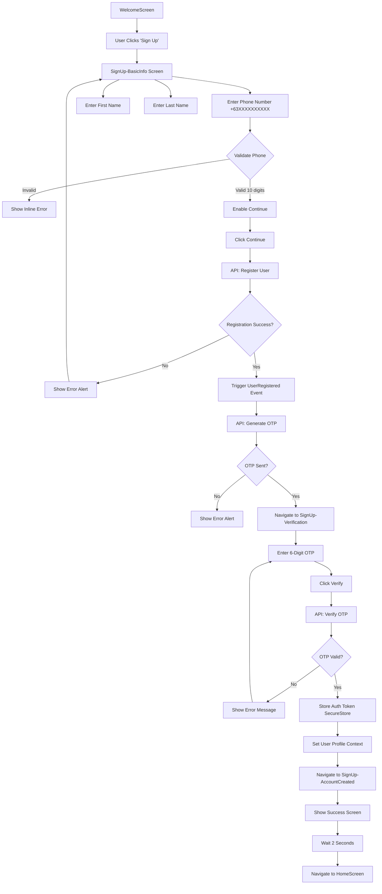
```mermaid
flowchart TD
    A[WelcomeScreen] --> B[User Clicks 'Sign Up']
    B --> C[SignUp-BasicInfo Screen]
    
    C --> D[Enter Phone Number +63XXXXXXXXXX]
    C --> E[Enter First Name]
    C --> F[Enter Last Name]
    
    D --> G{Validate Phone}
    G -->|Invalid| H[Show Inline Error]
    G -->|Valid 10 digits| I[Enable Continue]
    
    I --> J[Click Continue]
    J --> K[API: Register User]
    
    K --> L{Registration Success?}
    L -->|No| M[Show Error Alert]
    M --> C
    
    L -->|Yes| N[Trigger UserRegistered Event]
    N --> O[API: Generate OTP]
    
    O --> P{OTP Sent?}
    P -->|No| Q[Show Error Alert]
    P -->|Yes| R[Navigate to SignUp-Verification]
    
    R --> S[Enter 6-Digit OTP]
    S --> T[Click Verify]
    T --> U[API: Verify OTP]
    
    U --> V{OTP Valid?}
    V -->|No| W[Show Error Message]
    W --> S
    
    V -->|Yes| X[Store Auth Token SecureStore]
    X --> Y[Set User Profile Context]
    Y --> Z[Navigate to SignUp-AccountCreated]
    
    Z --> AA[Show Success Screen]
    AA --> AB[Wait 2 Seconds]
    AB --> AC[Navigate to HomeScreen]
```

### 2.2 Log In Flow

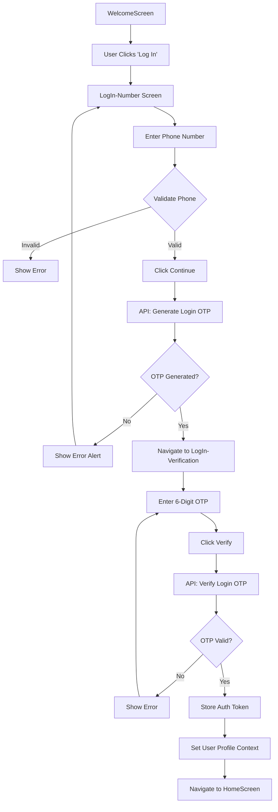
```mermaid
flowchart TD
    A[WelcomeScreen] --> B[User Clicks 'Log In']
    B --> C[LogIn-Number Screen]
    
    C --> D[Enter Phone Number]
    D --> E{Validate Phone}
    E -->|Invalid| F[Show Error]
    E -->|Valid| G[Click Continue]
    
    G --> H[API: Generate Login OTP]
    
    H --> I{OTP Generated?}
    I -->|No| J[Show Error Alert]
    J --> C
    
    I -->|Yes| K[Navigate to LogIn-Verification]
    K --> L[Enter 6-Digit OTP]
    
    L --> M[Click Verify]
    M --> N[API: Verify Login OTP]
    
    N --> O{OTP Valid?}
    O -->|No| P[Show Error]
    P --> L
    
    O -->|Yes| Q[Store Auth Token]
    Q --> R[Set User Profile Context]
    R --> S[Navigate to HomeScreen]
```

### 2.3 Auth Guard Flow

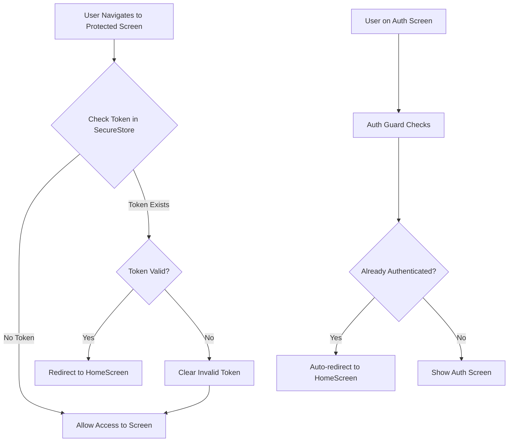
```mermaid
flowchart TD
    A[User Navigates to Protected Screen] --> B{Check Token in SecureStore}
    B -->|No Token| C[Allow Access to Screen]
    B -->|Token Exists| D{Token Valid?}
    
    D -->|Yes| E[Redirect to HomeScreen]
    D -->|No| F[Clear Invalid Token]
    F --> C
    
    G[User on Auth Screen] --> H[Auth Guard Checks]
    H --> I{Already Authenticated?}
    I -->|Yes| J[Auto-redirect to HomeScreen]
    I -->|No| K[Show Auth Screen]
```

---

## 3. Main Application Flow

### 3.1 Tab Navigation Structure

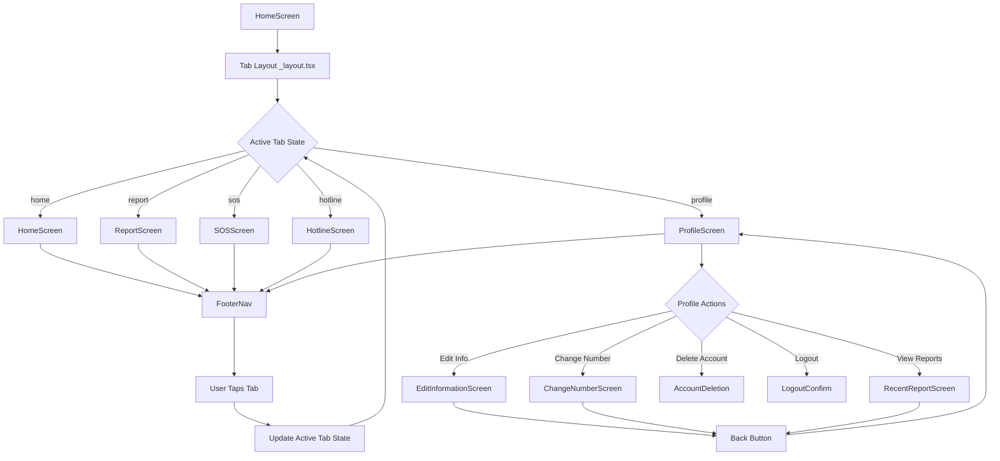
```mermaid
flowchart TD
    A[HomeScreen] --> B[Tab Layout _layout.tsx]
    
    B --> C{Active Tab State}
    
    C -->|home| D[HomeScreen]
    C -->|report| E[ReportScreen]
    C -->|sos| F[SOSScreen]
    C -->|hotline| G[HotlineScreen]
    C -->|profile| H[ProfileScreen]
    
    D --> I[FooterNav]
    E --> I
    F --> I
    G --> I
    H --> I
    
    I --> J[User Taps Tab]
    J --> K[Update Active Tab State]
    K --> C
    
    H --> L{Profile Actions}
    L -->|Edit Info| M[EditInformationScreen]
    L -->|Change Number| N[ChangeNumberScreen]
    L -->|View Reports| O[RecentReportScreen]
    L -->|Delete Account| P[AccountDeletion]
    L -->|Logout| Q[LogoutConfirm]
    
    M --> R[Back Button]
    N --> R
    O --> R
    R --> H
```

### 3.2 Home Screen Flow

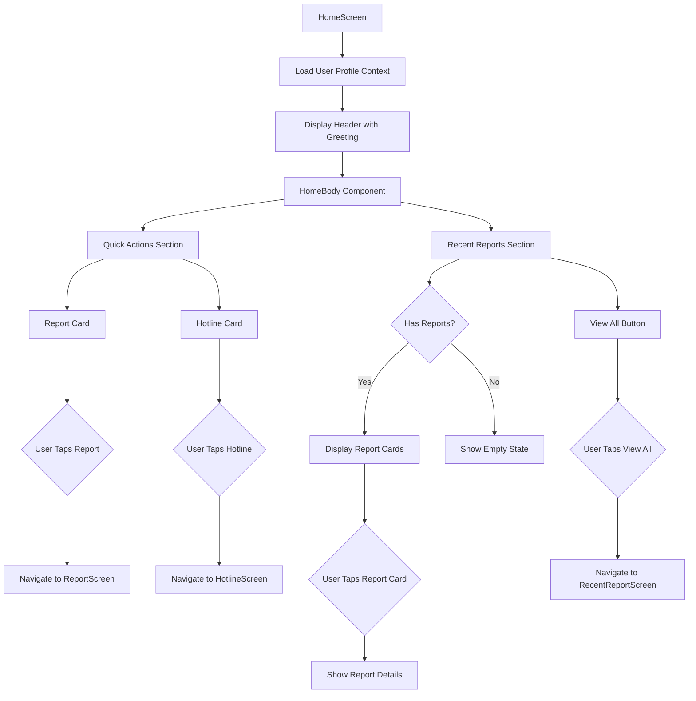
```mermaid
flowchart TD
    A[HomeScreen] --> B[Load User Profile Context]
    B --> C[Display Header with Greeting]
    
    C --> D[HomeBody Component]
    D --> E[Quick Actions Section]
    
    E --> F[Report Card]
    E --> G[Hotline Card]
    
    F --> H{User Taps Report}
    H --> I[Navigate to ReportScreen]
    
    G --> J{User Taps Hotline}
    J --> K[Navigate to HotlineScreen]
    
    D --> L[Recent Reports Section]
    L --> M{Has Reports?}
    M -->|Yes| N[Display Report Cards]
    M -->|No| O[Show Empty State]
    
    N --> P{User Taps Report Card}
    P --> Q[Show Report Details]
    
    L --> R[View All Button]
    R --> S{User Taps View All}
    S --> T[Navigate to RecentReportScreen]
```

---

## 4. Emergency Reporting Flow

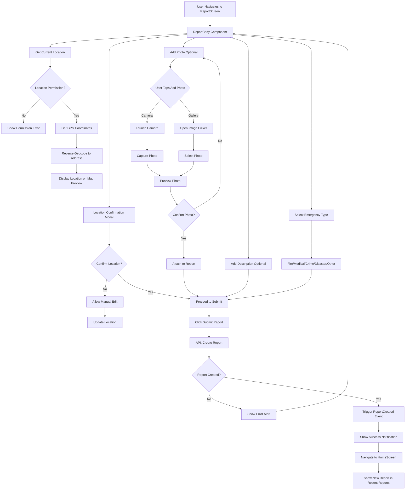
```mermaid
flowchart TD
    A[User Navigates to ReportScreen] --> B[ReportBody Component]
    
    B --> C[Get Current Location]
    C --> D{Location Permission?}
    D -->|No| E[Show Permission Error]
    D -->|Yes| F[Get GPS Coordinates]
    
    F --> G[Reverse Geocode to Address]
    G --> H[Display Location on Map Preview]
    
    B --> I[Select Emergency Type]
    I --> J[Fire/Medical/Crime/Disaster/Other]
    
    B --> K[Add Description Optional]
    
    B --> L[Add Photo Optional]
    L --> M{User Taps Add Photo}
    M -->|Camera| N[Launch Camera]
    M -->|Gallery| O[Open Image Picker]
    
    N --> P[Capture Photo]
    O --> Q[Select Photo]
    
    P --> R[Preview Photo]
    Q --> R
    R --> S{Confirm Photo?}
    S -->|No| L
    S -->|Yes| T[Attach to Report]
    
    B --> U[Location Confirmation Modal]
    U --> V{Confirm Location?}
    V -->|No| W[Allow Manual Edit]
    W --> X[Update Location]
    V -->|Yes| Y[Proceed to Submit]
    
    T --> Y
    K --> Y
    J --> Y
    
    Y --> Z[Click Submit Report]
    Z --> AA[API: Create Report]
    
    AA --> AB{Report Created?}
    AB -->|No| AC[Show Error Alert]
    AC --> B
    
    AB -->|Yes| AD[Trigger ReportCreated Event]
    AD --> AE[Show Success Notification]
    AE --> AF[Navigate to HomeScreen]
    AF --> AG[Show New Report in Recent Reports]
```

### Report Data Structure:
```typescript
{
  type: string,           // Emergency type
  description?: string,   // Optional description
  location: {
    latitude: number,
    longitude: number,
    address: string
  },
  photoUri?: string,      // Optional photo
  timestamp: string
}
```

---

## 5. SOS Emergency Flow

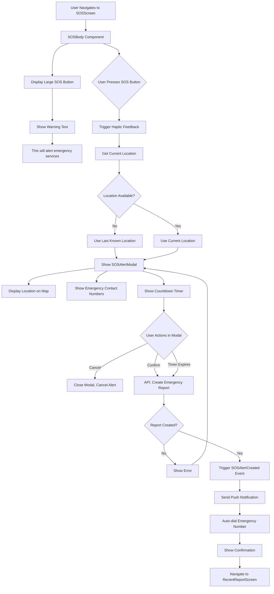
```mermaid
flowchart TD
    A[User Navigates to SOSScreen] --> B[SOSBody Component]
    
    B --> C[Display Large SOS Button]
    C --> D[Show Warning Text]
    D --> E["This will alert emergency services"]
    
    B --> F{User Presses SOS Button}
    F --> G[Trigger Haptic Feedback]
    
    G --> H[Get Current Location]
    H --> I{Location Available?}
    I -->|No| J[Use Last Known Location]
    I -->|Yes| K[Use Current Location]
    
    J --> L[Show SOSAlertModal]
    K --> L
    
    L --> M[Display Location on Map]
    L --> N[Show Emergency Contact Numbers]
    L --> O[Show Countdown Timer]
    
    O --> P{User Actions in Modal}
    P -->|Cancel| Q[Close Modal, Cancel Alert]
    P -->|Confirm| R[API: Create Emergency Report]
    P -->|Timer Expires| R
    
    R --> S{Report Created?}
    S -->|No| T[Show Error]
    T --> L
    
    S -->|Yes| U[Trigger SOSAlertCreated Event]
    U --> V[Send Push Notification]
    V --> W[Auto-dial Emergency Number]
    W --> X[Show Confirmation]
    X --> Y[Navigate to RecentReportScreen]
```

### SOS Special Features:
- **Auto-location**: Automatically captures location
- **Timer countdown**: 10-second countdown before auto-submission
- **Direct dial**: Auto-calls emergency services
- **High priority**: Marked as urgent in backend

---

## 6. Hotline Access Flow

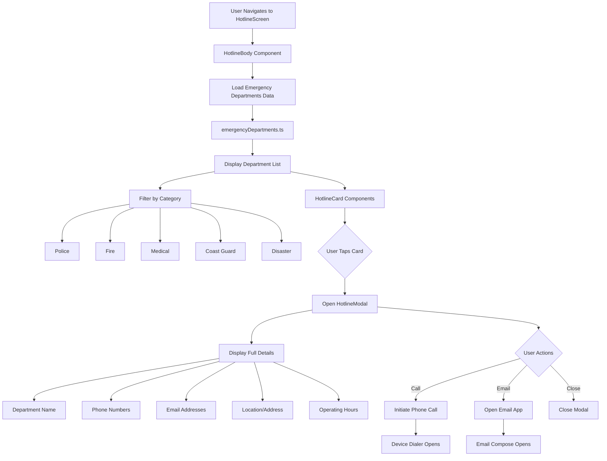
```mermaid
flowchart TD
    A[User Navigates to HotlineScreen] --> B[HotlineBody Component]
    
    B --> C[Load Emergency Departments Data]
    C --> D[emergencyDepartments.ts]
    
    D --> E[Display Department List]
    E --> F[Filter by Category]
    
    F --> G[Police]
    F --> H[Fire]
    F --> I[Medical]
    F --> J[Coast Guard]
    F --> K[Disaster]
    
    E --> L[HotlineCard Components]
    L --> M{User Taps Card}
    
    M --> N[Open HotlineModal]
    N --> O[Display Full Details]
    
    O --> P[Department Name]
    O --> Q[Phone Numbers]
    O --> R[Email Addresses]
    O --> S[Location/Address]
    O --> T[Operating Hours]
    
    N --> U{User Actions}
    U -->|Call| V[Initiate Phone Call]
    U -->|Email| W[Open Email App]
    U -->|Close| X[Close Modal]
    
    V --> Y[Device Dialer Opens]
    W --> Z[Email Compose Opens]
```

### Emergency Department Data Structure:
```typescript
interface EmergencyDepartment {
  id: string;
  name: string;
  category: 'police' | 'fire' | 'medical' | 'coast-guard' | 'disaster';
  phoneNumbers: string[];
  emails: string[];
  address: string;
  operatingHours: string;
  isEmergency: boolean;
}
```

---

## 7. Profile Management Flow

### 7.1 Profile Screen Flow

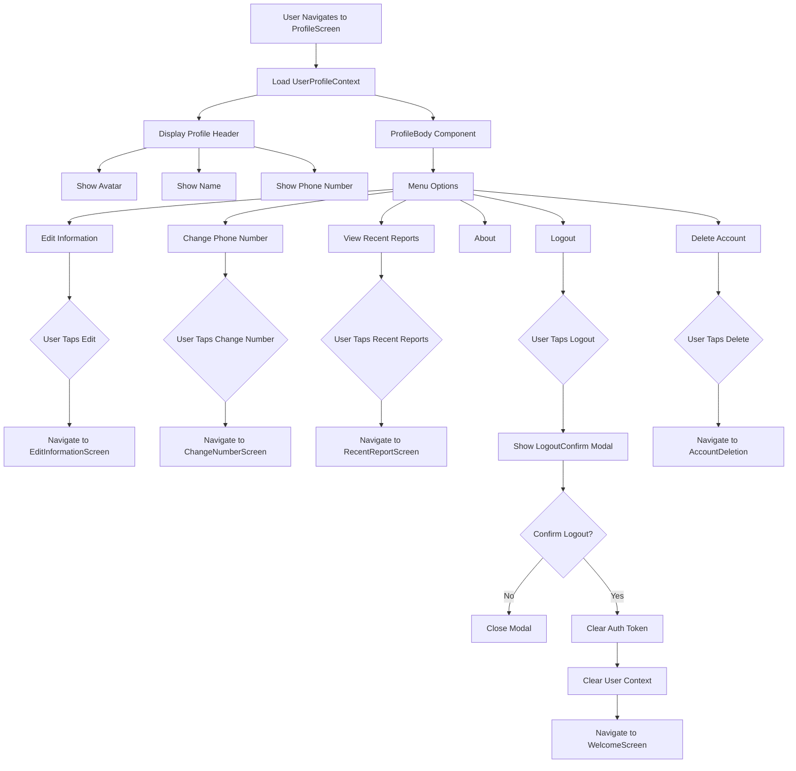
```mermaid
flowchart TD
    A[User Navigates to ProfileScreen] --> B[Load UserProfileContext]
    
    B --> C[Display Profile Header]
    C --> D[Show Avatar]
    C --> E[Show Name]
    C --> F[Show Phone Number]
    
    B --> G[ProfileBody Component]
    G --> H[Menu Options]
    
    H --> I[Edit Information]
    H --> J[Change Phone Number]
    H --> K[View Recent Reports]
    H --> L[About]
    H --> M[Logout]
    H --> N[Delete Account]
    
    I --> O{User Taps Edit}
    O --> P[Navigate to EditInformationScreen]
    
    J --> Q{User Taps Change Number}
    Q --> R[Navigate to ChangeNumberScreen]
    
    K --> S{User Taps Recent Reports}
    S --> T[Navigate to RecentReportScreen]
    
    M --> U{User Taps Logout}
    U --> V[Show LogoutConfirm Modal]
    V --> W{Confirm Logout?}
    W -->|No| X[Close Modal]
    W -->|Yes| Y[Clear Auth Token]
    Y --> Z[Clear User Context]
    Z --> AA[Navigate to WelcomeScreen]
    
    N --> AB{User Taps Delete}
    AB --> AC[Navigate to AccountDeletion]
```

### 7.2 Edit Information Flow

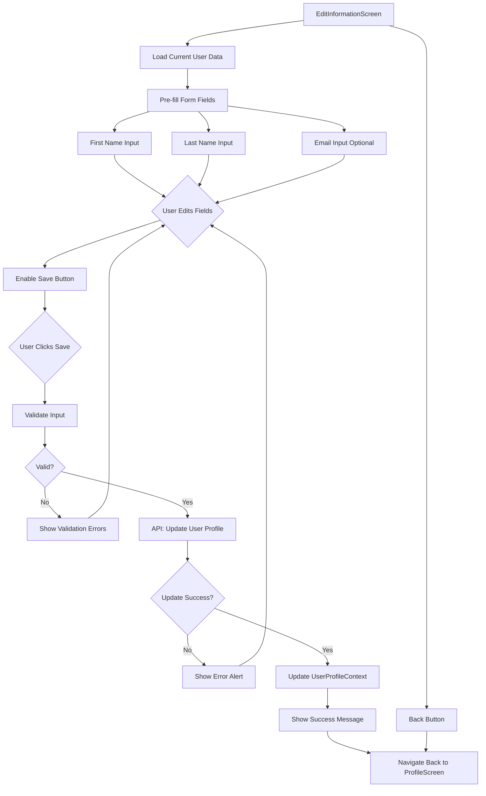
```mermaid
flowchart TD
    A[EditInformationScreen] --> B[Load Current User Data]
    
    B --> C[Pre-fill Form Fields]
    C --> D[First Name Input]
    C --> E[Last Name Input]
    C --> F[Email Input Optional]
    
    D --> G{User Edits Fields}
    E --> G
    F --> G
    
    G --> H[Enable Save Button]
    H --> I{User Clicks Save}
    
    I --> J[Validate Input]
    J --> K{Valid?}
    K -->|No| L[Show Validation Errors]
    L --> G
    
    K -->|Yes| M[API: Update User Profile]
    M --> N{Update Success?}
    N -->|No| O[Show Error Alert]
    O --> G
    
    N -->|Yes| P[Update UserProfileContext]
    P --> Q[Show Success Message]
    Q --> R[Navigate Back to ProfileScreen]
    
    A --> S[Back Button]
    S --> R
```

### 7.3 Change Phone Number Flow

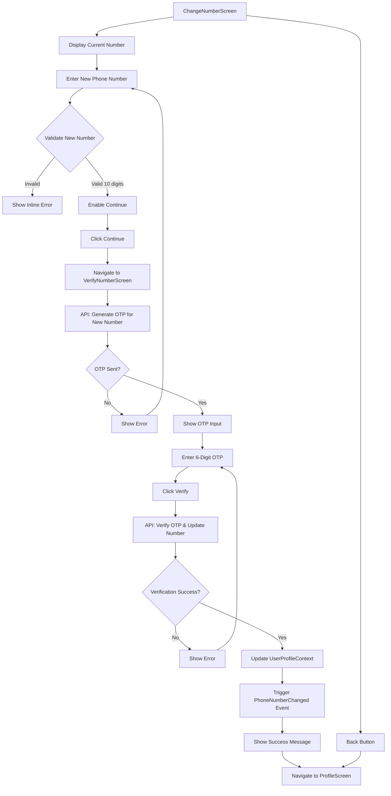
```mermaid
flowchart TD
    A[ChangeNumberScreen] --> B[Display Current Number]
    
    B --> C[Enter New Phone Number]
    C --> D{Validate New Number}
    D -->|Invalid| E[Show Inline Error]
    D -->|Valid 10 digits| F[Enable Continue]
    
    F --> G[Click Continue]
    G --> H[Navigate to VerifyNumberScreen]
    
    H --> I[API: Generate OTP for New Number]
    I --> J{OTP Sent?}
    J -->|No| K[Show Error]
    K --> C
    
    J -->|Yes| L[Show OTP Input]
    L --> M[Enter 6-Digit OTP]
    M --> N[Click Verify]
    
    N --> O[API: Verify OTP & Update Number]
    O --> P{Verification Success?}
    P -->|No| Q[Show Error]
    Q --> M
    
    P -->|Yes| R[Update UserProfileContext]
    R --> S[Trigger PhoneNumberChanged Event]
    S --> T[Show Success Message]
    T --> U[Navigate to ProfileScreen]
    
    A --> V[Back Button]
    V --> U
```

### 7.4 Account Deletion Flow

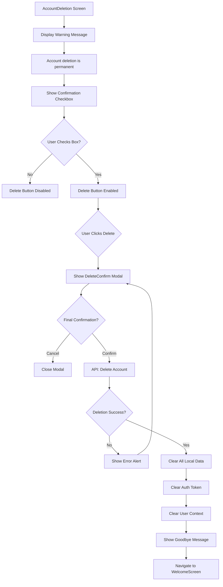
```mermaid
flowchart TD
    A[AccountDeletion Screen] --> B[Display Warning Message]
    B --> C["Account deletion is permanent"]
    
    C --> D[Show Confirmation Checkbox]
    D --> E{User Checks Box?}
    E -->|No| F[Delete Button Disabled]
    E -->|Yes| G[Delete Button Enabled]
    
    G --> H{User Clicks Delete}
    H --> I[Show DeleteConfirm Modal]
    
    I --> J{Final Confirmation?}
    J -->|Cancel| K[Close Modal]
    J -->|Confirm| L[API: Delete Account]
    
    L --> M{Deletion Success?}
    M -->|No| N[Show Error Alert]
    N --> I
    
    M -->|Yes| O[Clear All Local Data]
    O --> P[Clear Auth Token]
    P --> Q[Clear User Context]
    Q --> R[Show Goodbye Message]
    R --> S[Navigate to WelcomeScreen]
```

---

## 8. Report Tracking Flow

### 8.1 Recent Reports Screen Flow

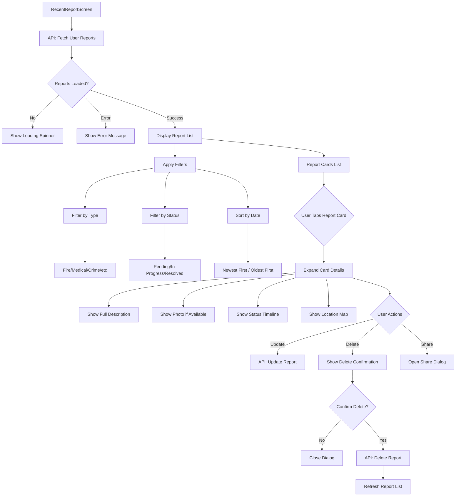
```mermaid
flowchart TD
    A[RecentReportScreen] --> B[API: Fetch User Reports]
    
    B --> C{Reports Loaded?}
    C -->|No| D[Show Loading Spinner]
    C -->|Error| E[Show Error Message]
    C -->|Success| F[Display Report List]
    
    F --> G[Apply Filters]
    G --> H[Filter by Type]
    G --> I[Filter by Status]
    G --> J[Sort by Date]
    
    H --> K[Fire/Medical/Crime/etc]
    I --> L[Pending/In Progress/Resolved]
    J --> M[Newest First / Oldest First]
    
    F --> N[Report Cards List]
    N --> O{User Taps Report Card}
    
    O --> P[Expand Card Details]
    P --> Q[Show Full Description]
    P --> R[Show Photo if Available]
    P --> S[Show Status Timeline]
    P --> T[Show Location Map]
    
    P --> U{User Actions}
    U -->|Update| V[API: Update Report]
    U -->|Delete| W[Show Delete Confirmation]
    U -->|Share| X[Open Share Dialog]
    
    W --> Y{Confirm Delete?}
    Y -->|No| Z[Close Dialog]
    Y -->|Yes| AA[API: Delete Report]
    AA --> AB[Refresh Report List]
```

### 8.2 Report Status Updates Flow

```mermaid
flowchart TD
    A[Backend Report Status Changes] --> B[Server Sends Domain Event]
    
    B --> C{Event Type}
    C -->|ReportCreated| D[Show Success Notification]
    C -->|ReportStatusChanged| E[Push Notification to User]
    C -->|ReportAssigned| F[Notify Assignment]
    C -->|ReportResolved| G[Show Resolution Notification]
    
    E --> H[Update Report in Local State]
    H --> I[Refresh Recent Reports]
    
    G --> J[Show "Report Resolved" Banner]
    J --> K[Allow User Feedback]
    
    K --> L{User Provides Feedback?}
    L -->|Yes| M[API: Submit Feedback]
    L -->|No| N[Close Banner]
    
    M --> O[Thank You Message]
```

---

## 9. Data Flow Architecture

### 9.1 API Layer Flow

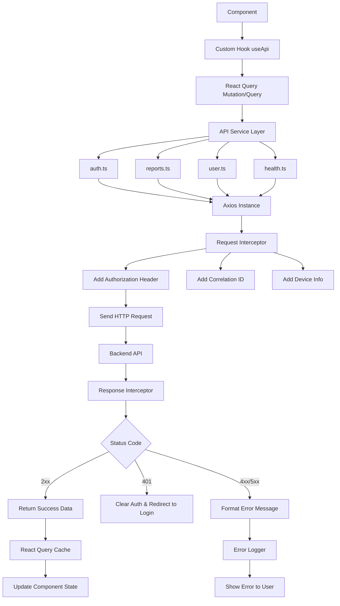
```mermaid
flowchart TD
    A[Component] --> B[Custom Hook useApi]
    
    B --> C[React Query Mutation/Query]
    
    C --> D[API Service Layer]
    D --> E[auth.ts]
    D --> F[reports.ts]
    D --> G[user.ts]
    D --> H[health.ts]
    
    E --> I[Axios Instance]
    F --> I
    G --> I
    H --> I
    
    I --> J[Request Interceptor]
    J --> K[Add Authorization Header]
    J --> L[Add Correlation ID]
    J --> M[Add Device Info]
    
    K --> N[Send HTTP Request]
    
    N --> O[Backend API]
    
    O --> P[Response Interceptor]
    P --> Q{Status Code}
    
    Q -->|2xx| R[Return Success Data]
    Q -->|401| S[Clear Auth & Redirect to Login]
    Q -->|4xx/5xx| T[Format Error Message]
    
    R --> U[React Query Cache]
    U --> V[Update Component State]
    
    T --> W[Error Logger]
    W --> X[Show Error to User]
```

### 9.2 State Management Flow

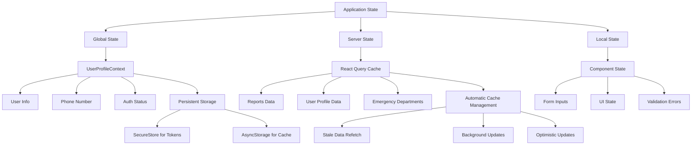
```mermaid
flowchart TD
    A[Application State] --> B[Global State]
    A --> C[Server State]
    A --> D[Local State]
    
    B --> E[UserProfileContext]
    E --> F[User Info]
    E --> G[Phone Number]
    E --> H[Auth Status]
    
    C --> I[React Query Cache]
    I --> J[Reports Data]
    I --> K[User Profile Data]
    I --> L[Emergency Departments]
    
    D --> M[Component State]
    M --> N[Form Inputs]
    M --> O[UI State]
    M --> P[Validation Errors]
    
    E --> Q[Persistent Storage]
    Q --> R[SecureStore for Tokens]
    Q --> S[AsyncStorage for Cache]
    
    I --> T[Automatic Cache Management]
    T --> U[Stale Data Refetch]
    T --> V[Background Updates]
    T --> W[Optimistic Updates]
```

### 9.3 Location Services Flow

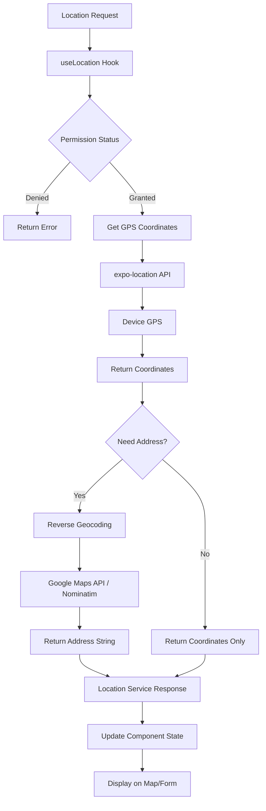
```mermaid
flowchart TD
    A[Location Request] --> B[useLocation Hook]
    
    B --> C{Permission Status}
    C -->|Denied| D[Return Error]
    C -->|Granted| E[Get GPS Coordinates]
    
    E --> F[expo-location API]
    F --> G[Device GPS]
    
    G --> H[Return Coordinates]
    H --> I{Need Address?}
    
    I -->|Yes| J[Reverse Geocoding]
    J --> K[Google Maps API / Nominatim]
    K --> L[Return Address String]
    
    I -->|No| M[Return Coordinates Only]
    
    L --> N[Location Service Response]
    M --> N
    
    N --> O[Update Component State]
    O --> P[Display on Map/Form]
```

---

## 10. Error Handling Flow

### 10.1 API Error Handling

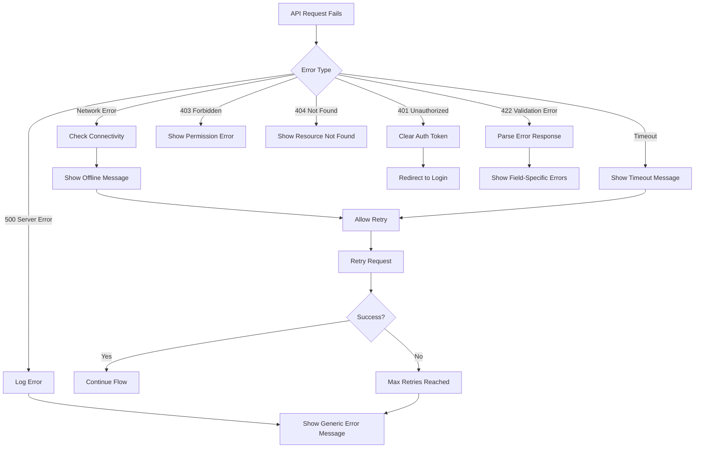
```mermaid
flowchart TD
    A[API Request Fails] --> B{Error Type}
    
    B -->|Network Error| C[Check Connectivity]
    C --> D[Show Offline Message]
    D --> E[Allow Retry]
    
    B -->|Timeout| F[Show Timeout Message]
    F --> E
    
    B -->|401 Unauthorized| G[Clear Auth Token]
    G --> H[Redirect to Login]
    
    B -->|403 Forbidden| I[Show Permission Error]
    
    B -->|404 Not Found| J[Show Resource Not Found]
    
    B -->|422 Validation Error| K[Parse Error Response]
    K --> L[Show Field-Specific Errors]
    
    B -->|500 Server Error| M[Log Error]
    M --> N[Show Generic Error Message]
    
    E --> O[Retry Request]
    O --> P{Success?}
    P -->|Yes| Q[Continue Flow]
    P -->|No| R[Max Retries Reached]
    R --> N
```

### 10.2 Form Validation Flow

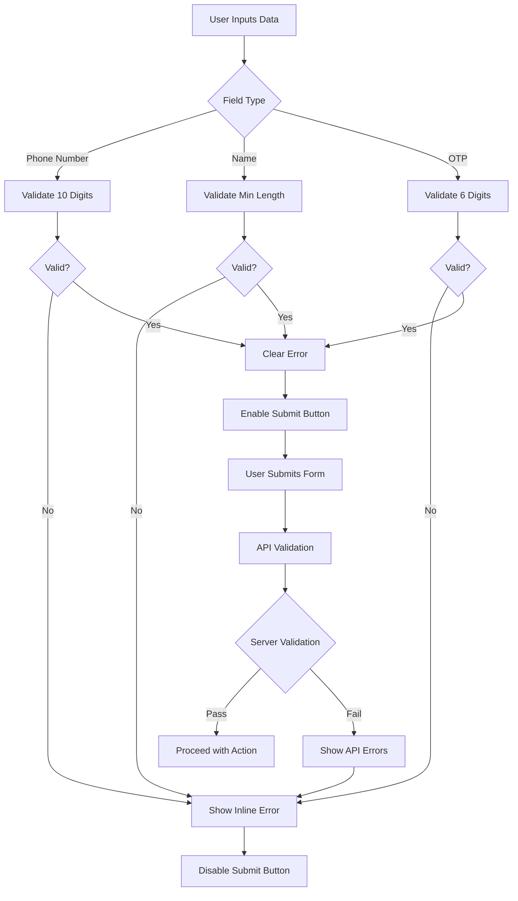
```mermaid
flowchart TD
    A[User Inputs Data] --> B{Field Type}
    
    B -->|Phone Number| C[Validate 10 Digits]
    C --> D{Valid?}
    D -->|No| E[Show Inline Error]
    D -->|Yes| F[Clear Error]
    
    B -->|Name| G[Validate Min Length]
    G --> H{Valid?}
    H -->|No| E
    H -->|Yes| F
    
    B -->|OTP| I[Validate 6 Digits]
    I --> J{Valid?}
    J -->|No| E
    J -->|Yes| F
    
    F --> K[Enable Submit Button]
    E --> L[Disable Submit Button]
    
    K --> M[User Submits Form]
    M --> N[API Validation]
    
    N --> O{Server Validation}
    O -->|Pass| P[Proceed with Action]
    O -->|Fail| Q[Show API Errors]
    Q --> E
```

### 10.3 Runtime Error Handling

```mermaid
flowchart TD
    A[Runtime Error Occurs] --> B[Error Logger Utility]
    
    B --> C[Log to Console]
    B --> D{Error Severity}
    
    D -->|Critical| E[Log to Error Service]
    D -->|Warning| F[Log Locally]
    D -->|Info| G[Console Only]
    
    E --> H[Send to Backend Logging]
    
    B --> I{User Impact}
    I -->|Blocking| J[Show Error Alert]
    I -->|Non-blocking| K[Show Toast Message]
    I -->|Silent| L[Background Log Only]
    
    J --> M[Provide Action Options]
    M --> N[Retry]
    M --> O[Go Back]
    M --> P[Contact Support]
    
    K --> Q[Auto-dismiss After 3s]
```

---

## Component Interaction Matrix

| Component | HomeScreen | ReportScreen | SOSScreen | HotlineScreen | ProfileScreen |
|-----------|------------|--------------|-----------|---------------|---------------|
| **FooterNav** | ✅ Active | ✅ Navigate | ✅ Navigate | ✅ Navigate | ✅ Navigate |
| **Header** | ✅ "Home" | ✅ "Report" | ✅ "SOS" | ✅ "Hotline" | ✅ "Profile" |
| **UserContext** | ✅ Read | ✅ Read | ✅ Read | ❌ None | ✅ Read/Write |
| **Location** | ❌ None | ✅ Required | ✅ Required | ❌ None | ❌ None |
| **API Calls** | ✅ Get Reports | ✅ Create Report | ✅ Create SOS | ❌ None | ✅ Update User |
| **Camera** | ❌ None | ✅ Optional | ❌ None | ❌ None | ❌ None |

---

## Screen Navigation Map

```mermaid
graph TD
    A[WelcomeScreen] --> B[SignUp-BasicInfo]
    A --> C[LogIn-Number]
    
    B --> D[SignUp-Verification]
    D --> E[SignUp-AccountCreated]
    E --> F[HomeScreen]
    
    C --> G[LogIn-Verification]
    G --> F
    
    F --> H[ReportScreen]
    F --> I[SOSScreen]
    F --> J[HotlineScreen]
    F --> K[ProfileScreen]
    
    K --> L[EditInformationScreen]
    K --> M[ChangeNumberScreen]
    K --> N[RecentReportScreen]
    K --> O[AccountDeletion]
    
    M --> P[VerifyNumberScreen]
    
    L --> K
    M --> K
    N --> K
    P --> K
    
    O --> A
    K -->|Logout| A
```

---

## Summary

This flow chart documents all major user flows in the ResQLink frontend application, including:

1. **Launch & Authentication**: App initialization, OTP-based signup/login
2. **Main Navigation**: Tab-based navigation with 5 main screens
3. **Emergency Features**: Report creation, SOS alerts, hotline access
4. **Profile Management**: User data editing, phone change, account deletion
5. **Report Tracking**: View, filter, and manage emergency reports
6. **Data Architecture**: API layer, state management, location services
7. **Error Handling**: Comprehensive error handling at all layers

Each flow includes decision points, success/failure paths, and API interactions for complete system understanding.
